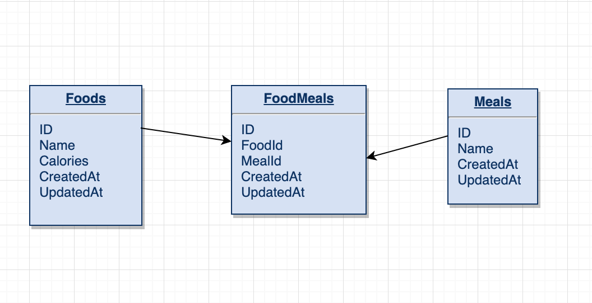

## Calorie Counts

### Overview
Calorie Counts is a 2 week paired project for Module 4 at Turing School of Software and Design, made by [Rob Stringer](https://github.com/mycobee) and [Logan Pile](https://github.com/lpile).  The project implements the Express framework with Node.js to build a RESTful API returning meal and food information.  A Postgres database with many to many schema holds meal and food information to track calorie consumption.  Also implemented is a single page front end with JQuery and ajax calls to the API.

**Tech Stack**
* Node.js
* Express
* TravisCI
* Jest
* JQuery
* JavaScript
* HTML5/CSS3/SCSS

### Project Boards
#### [Week 1 Project Board](https://github.com/lpile/calorie-counts/projects/2)
#### [Week 2 Project Board](https://github.com/lpile/calorie-counts/projects/3)

### Endpoints  
#### [calorie-counts.herokuapp.com](https://calorie-counts.herokuapp.com)

**GET /api/v1/foods**  

*Returns all foods*  

Request:
```
Content-Type: application/json
Accept: application/json
```
Response:
```
status: 200
body:
{
  foods: [
    {
      "id": 1,
      "name": "Banana",
      "calories": 150
    },
    {
      "id": 2,
      "name": "Apple",
      "calories": 10
    }
  ] 
}
```

**GET /api/v1/foods/:id**  

*Returns a single food*
  
Request:
```
Content-Type: application/json
Accept: application/json
```
Response:
```
status: 200
body:
{
    "id": 1,
    "name": "Banana",
    "calories": 150
}
```

**POST /api/v1/foods**  

*Creates a single food* 
 
Request:
```
POST /api/v1/foods
Content-Type: application/json
Accept: application/json

body:
{ 
  "food": 
    {
      "name": "Name of food here",
      "calories": "Calories here"
    }
}
```
Response:
```
status: 201
body:
{ 
  "message": "FOODNAME has been added"
}
```

**PATCH /api/v1/foods/:id** 

*Updates a single food*  

Request:
```
PATCH /api/v1/foods/:id
Content-Type: application/json
Accept: application/json

{ "food": { "name": "Mint", "calories": "14"} }
```
Response:
```
status: 202
body: 
{
    "id": 1,
    "name": "Mint",
    "calories": 14
}
```

**DELETE /api/v1/foods/:id**   

*Deletes a single food*
  
Request:
```
Content-Type: application/json
Accept: application/json
```
Response:
```
status: 204
```

**GET /api/v1/meals**  

*Returns all meals*

Request
```
Content-Type: application/json
Accept: application/json
```
Response
```
[
  {
    "id": 1,
    "name": "Breakfast",
    "foods": [
        {
          "id": 1,
          "name": "Banana",
          "calories": 150
      },
      {
        "id": 6,
        "name": "Yogurt",
        "calories": 550
      },
      {
        "id": 12,
        "name": "Apple",
        "calories": 220
      }
    ]
  },
  {
    "id": 2,
    "name": "Snack",
    "foods": [
      {
        "id": 1,
        "name": "Banana",
        "calories": 150
      },
      {
        "id": 9,
        "name": "Gum",
        "calories": 50
      },
      {
        "id": 10,
        "name": "Cheese",
        "calories": 400
      }
    ]
  }
]
```

**GET /api/v1/meals/:mealId/foods**   

*Returns a single meal and all its foods*

Request:
```
Content-Type: application/json
Accept: application/json
```
Response:
```
status: 200
body:
{
  "id": 1,
  "name": "Breakfast",
  "foods": [
    {
      "id": 1,
      "name": "Banana",
      "calories": 150
    },
    {
      "id": 6,
      "name": "Yogurt",
      "calories": 550
    },
    {
      "id": 12,
      "name": "Apple",
      "calories": 220
    }
  ]
}
```

**POST /api/v1/meals/:mealId/foods/:foodId** 

*Adds an existing food to an existing meal*

Request:
```
Content-Type: application/json
Accept: application/json
```
Response:
```
status: 201
body:
{
    "message": "successfully added FOODNAME to MEALNAME"
}
```

**DELETE /api/v1/meals/:mealId/foods/:foodId** 

*Removes a food from a meal, by deleting the joins table association*

Request:
```
Content-Type: application/json
Accept: application/json
```
Response:
```
status: 204
```

### Setup 

*Git Setup*

`git clone https://github.com/lpile/calorie-counts`
`cd calorie_counts`

*Database & Models*  

`$ npx sequelize db:create`  
`$ npx sequelize db:migrate`  
`$ npx sequelize db:seed:all`

### Versions
`node 10.16.0`  
`npm 6.9.0`  

### Packages
`$ npm install jest`  
`$ npm install `

*Testing*  
`$npm install babel-jest supertest shelljs -D`  
`$npm install jest-cli`   
`$npm test`

### Testing
Jest was used to test all endpoints.  Edge cases were also covered, as well as many status codes for different scenarios.  TravisCI was also used for integrating tests and deployment.  

### Schema

